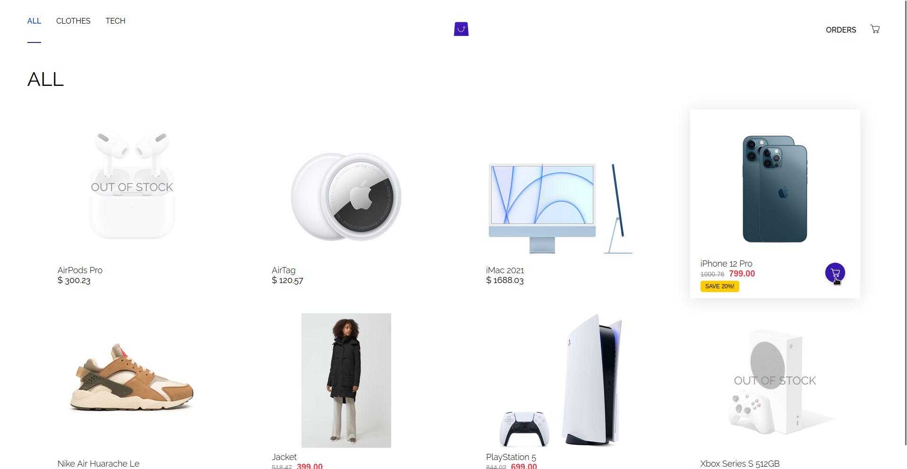
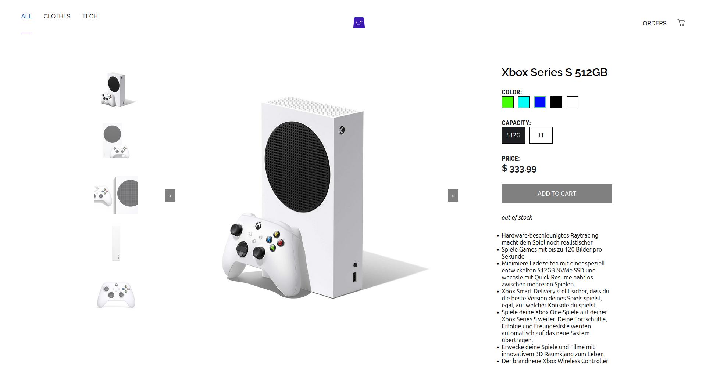
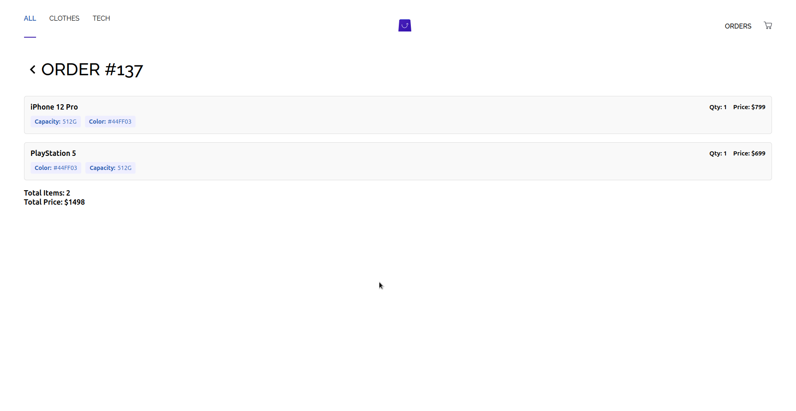

# Full-Stack E-commerce Web App

This repository contains a full-stack e-commerce web application built with PHP (backend), React (frontend), MySQL (database), and GraphQL for data retrieval.

## Features

- Product listing
- Cart functionality
- Order placement through GraphQL mutation

## Tech Stack

- Backend: PHP
- Frontend: React
- Database: MySQL
- API: GraphQL
- Containerization: Docker

## Screenshots

### Product Listing



### Product Details



### Cart


### Responsive Design

<div style="display: flex; justify-content: space-between;">
  
  
  
</div>

## Getting Started

### Prerequisites

- Docker
- Docker Compose

### Building and Running the Application

1. Clone this repository:

   ```
   git clone https://github.com/SandroK0/e-commerce-fullstack.git
   cd e-commerce-fullstack
   ```

2. Build the Docker containers:

   ```
   docker-compose build
   ```

3. Start the application:

   ```
   docker-compose up
   ```

4. Access the application in your web browser at `http://localhost:3000` (or the appropriate port if you've configured it differently).

To stop the application, press `Ctrl+C` in the terminal where it's running, or run:

```
docker-compose down
```

## GraphQL Queries

Here are some example GraphQL queries used in the application:

### Fetch Products

```graphql
  query {
    products {
        id
        name
        description
        inStock
        category {
            id
            name
        }
        brand
        images
        price {
            amount
            currency_label
            currency_symbol
        }
        attributes {
            id
            name
            type
            items {
                id
                value
                displayValue
            }
        }
    }
  }
`
```

### Fetch Product By Id

```graphql
query Product($id: String!) {
  product(id: $id) {
    id
    name
    description
    inStock
    brand
    images
    category {
      id
      name
    }
    price {
      amount
      currency_label
      currency_symbol
    }
    attributes {
      id
      name
      type
      items {
        id
        value
        displayValue
      }
    }
  }
}
```

### Place Order Mutation

```graphql
mutation placeOrder($items: [OrderItemInput!]!) {
  placeOrder(items: $items) {
    id
    items {
      product_id
      name
      quantity
      attributes {
        type
        name
        value
      }
    }
    order_date
  }
}
```

### Fetch Orders

```graphql
query Orders {
  orders {
    id
    order_date
    total
    items {
      product_id
      name
      quantity
      attributes {
        type
        name
        value
      }
      price {
        amount
        currency_label
        currency_symbol
      }
    }
  }
}
```

### Fetch Order By Id

```graphql
query Order($order_id: Int!) {
  order(order_id: $order_id) {
    id
    order_date
    total
    items {
      product_id
      name
      quantity
      attributes {
        type
        name
        value
      }
      price {
        amount
        currency_label
        currency_symbol
      }
    }
  }
}
```

## Database Schema

Below is a visual representation of the database tables using ASCII art:

```
+----------------+     +----------------+     +----------------+
|   products     |     |   categories   |     |    prices      |
+----------------+     +----------------+     +----------------+
| id (PK)        |     | id (PK)        |     | id (PK)        |
| name           |     | name           |     | product_id (FK)|
| description    |     +----------------+     | amount         |
| inStock        |                            | currency_label |
| category_id(FK)|     +----------------+     | currency_symbol|
| brand          |     |   attributes   |     +----------------+
+----------------+     +----------------+
        |               | id (PK)        |     +----------------+
        |               | name           |     | product_images |
        |               | type           |     +----------------+
        |               +----------------+     | id (PK)        |
        |                                      | product_id (FK)|
        |               +----------------+     | image_url      |
        |               |attribute_items |     +----------------+
        |               +----------------+
        |               | id (PK)        |     +----------------+
        |               | product_id (FK)|     |product_attributes|
        |               | name           |     +----------------+
        |               | value          |     | id (PK)        |
        |               | displayValue   |     | product_id (FK)|
        |               +----------------+     | name           |
        |                                      | type           |
        |               +----------------+     +----------------+
        |               |    orders      |
        |               +----------------+     +----------------+
        |               | id (PK)        |     | order_items    |
        |               | order_date     |     +----------------+
        |               +----------------+     | id (PK)        |
        |                        |             | order_id (FK)  |
        |                        |             | product_id (FK)|
        |                        |             | name           |
        |                        |             | quantity       |
        |                        |             +----------------+
        |                        |
        |                        |             +----------------+
        |                        |             |order_item_attributes|
        |                        |             +----------------+
        |                        |             | id (PK)        |
        |                        |             | item_id (FK)   |
        |                        |             | name           |
        |                        |             | value          |
        |                        |             | type           |
        |                        |             +----------------+
```

### SQL Schema

```sql
CREATE TABLE `products` (
  `id` varchar(255) NOT NULL,
  `name` varchar(255) DEFAULT NULL,
  `description` text,
  `inStock` tinyint(1) DEFAULT NULL,
  `category_id` int DEFAULT NULL,
  `brand` varchar(255) DEFAULT NULL,
  PRIMARY KEY (`id`),
  KEY `category_id` (`category_id`),
  CONSTRAINT `products_ibfk_1` FOREIGN KEY (`category_id`) REFERENCES `categories` (`id`)
);

CREATE TABLE `categories` (
  `id` int NOT NULL AUTO_INCREMENT,
  `name` varchar(255) DEFAULT NULL,
  PRIMARY KEY (`id`),
  UNIQUE KEY `name` (`name`)
);

CREATE TABLE `prices` (
  `id` int NOT NULL AUTO_INCREMENT,
  `product_id` varchar(255) DEFAULT NULL,
  `amount` decimal(10,2) DEFAULT NULL,
  `currency_label` varchar(255) DEFAULT NULL,
  `currency_symbol` char(1) DEFAULT NULL,
  PRIMARY KEY (`id`),
  KEY `product_id` (`product_id`),
  CONSTRAINT `prices_ibfk_1` FOREIGN KEY (`product_id`) REFERENCES `products` (`id`)
);

CREATE TABLE `product_images` (
  `id` int NOT NULL AUTO_INCREMENT,
  `product_id` varchar(255) DEFAULT NULL,
  `image_url` text,
  PRIMARY KEY (`id`),
  KEY `product_id` (`product_id`),
  CONSTRAINT `product_images_ibfk_1` FOREIGN KEY (`product_id`) REFERENCES `products` (`id`)
);

CREATE TABLE `attributes` (
  `id` varchar(255) NOT NULL,
  `name` varchar(255) DEFAULT NULL,
  `type` varchar(50) DEFAULT NULL,
  PRIMARY KEY (`id`)
);

CREATE TABLE `attribute_items` (
  `id` int NOT NULL AUTO_INCREMENT,
  `product_id` varchar(255) DEFAULT NULL,
  `name` varchar(255) DEFAULT NULL,
  `value` varchar(255) DEFAULT NULL,
  `displayValue` varchar(255) DEFAULT NULL,
  PRIMARY KEY (`id`),
  KEY `product_id` (`product_id`),
  CONSTRAINT `attribute_items_ibfk_1` FOREIGN KEY (`product_id`) REFERENCES `products` (`id`)
);

CREATE TABLE `product_attributes` (
  `id` int NOT NULL AUTO_INCREMENT,
  `product_id` varchar(255) DEFAULT NULL,
  `name` varchar(255) DEFAULT NULL,
  `type` varchar(255) DEFAULT NULL,
  PRIMARY KEY (`id`),
  KEY `product_id` (`product_id`),
  CONSTRAINT `product_attributes_ibfk_1` FOREIGN KEY (`product_id`) REFERENCES `products` (`id`)
);

CREATE TABLE `orders` (
  `id` int NOT NULL AUTO_INCREMENT,
  `order_date` timestamp NULL DEFAULT CURRENT_TIMESTAMP,
  PRIMARY KEY (`id`)
);

CREATE TABLE `order_items` (
  `id` int NOT NULL AUTO_INCREMENT,
  `order_id` int DEFAULT NULL,
  `product_id` varchar(255) DEFAULT NULL,
  `name` varchar(255) DEFAULT NULL,
  `quantity` int DEFAULT NULL,
  PRIMARY KEY (`id`),
  KEY `order_id` (`order_id`),
  CONSTRAINT `order_items_ibfk_1` FOREIGN KEY (`order_id`) REFERENCES `orders` (`id`) ON DELETE CASCADE
);

CREATE TABLE `order_item_attributes` (
  `id` int NOT NULL AUTO_INCREMENT,
  `item_id` int DEFAULT NULL,
  `name` varchar(255) DEFAULT NULL,
  `value` varchar(255) DEFAULT NULL,
  `type` varchar(255) DEFAULT NULL,
  PRIMARY KEY (`id`),
  KEY `item_id` (`item_id`),
  CONSTRAINT `order_item_attributes_ibfk_1` FOREIGN KEY (`item_id`) REFERENCES `order_items` (`id`) ON DELETE CASCADE
);
```
